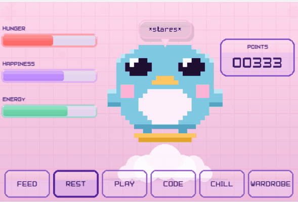

# Waddle ♡

> a tiny virtual pet with minigames ˚₊· ͟͟͞͞➳❥




---

## what is waddle ˘ᵕ˘

Waddle is a tiny desktop virtual pet with a Y2K kawaii aesthetic. keep your little penguin happy, play mini-games to earn fish, and dress her up from the boutique wardrobe ♡

---

## screens

| | |
|--|--|
|  |  |
| **idle** — feed, rest, watch her mood change | **chill** — live weather, lofi vibes, affirmations |

---

## games

| | |
|--|--|
|  |  |
| **dodge.exe** — dodge falling folder debris, catch fish | **code.exe** — simon says pattern, streak for bonus fish |

---

## get started

```bash
pip install pygame numpy
python waddle.py
```

The pixel font `Pixel7.ttf` is included — no extra downloads needed ♡

### optional: change your city

Open `waddle.py` and edit the three lines near the top:

```python
LAT  = 35.9606       # your latitude
LON  = -83.9207      # your longitude
CITY = "Knoxville, TN"
```

Find your coordinates at [latlong.net](https://www.latlong.net/).

---

## gameplay

### fish & points
- **dodge.exe** — catch fish to earn points. hit a **5-catch streak** and you earn **2 fish per catch** until you die
- **code.exe** — nail each round for 1 fish. **5-round streak** earns 2 fish and restores a life
- fish are your currency — spend them in the wardrobe

### mood system
Waddle's mood changes based on her hunger, happiness, and energy levels:

| mood | trigger |
|------|---------|
| 😊 happy | happiness > 78% |
| 🌟 excited | happiness > 90% + energy > 70% |
| 😴 sleepy | energy < 18% |
| 😢 sad | happiness < 22% |
| 😤 hungry | hunger > 78% |
| 😐 idle | everything else |

---

## controls

| key | does |
|-----|------|
| `← →` | navigate menus |
| `ENTER` | select |
| `ESC` | go back to main screen |
| `← →` | move in dodge |
| `↑ ↓ ← →` | pattern input in code |

---

## customization

Want a custom shelf figurine in the code room? Drop any small image next to `waddle.py` and name it `figurine.png`. Falls back to a drawn star if absent.

---

## credits

- pixel font: **Pixel7** by Sizenko Alexander (freeware)
- weather data: [Open-Meteo](https://open-meteo.com/) (free, no API key)
- made with [pygame](https://www.pygame.org) ♡
