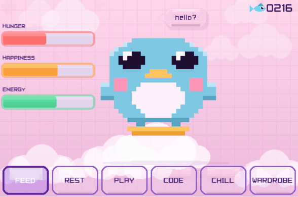
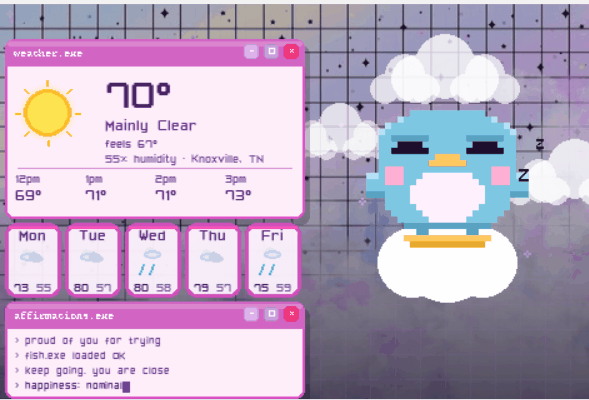
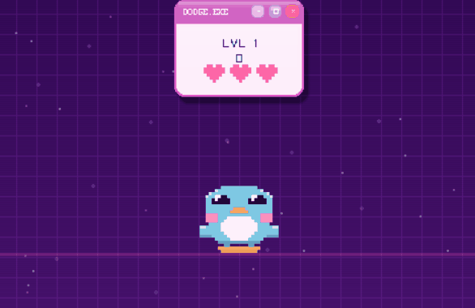

# Waddle ♡ ✮ ⋆ ˚｡𖦹 ⋆°°✩

> a tiny virtual pet with minigames ˚₊· ͟͟͞͞➳❥


## what is waddle? ˘ᵕ˘ ✩₊˚.⋆☾⋆⁺₊✧

Waddle is a virtual penguin with a cute cyber aesthetic. Keep her happy and play mini-games to earn fish. You can also dress her up with items from the boutique wardrobe. The eventual goal for Waddle is some kind of handheld Raspberry Pi contraption with buttons, a screen, and a joystick ♡ This is a fun personal project as I enjoy soldering and messing with things

---

## screens ★₊˚⊹✧˖°.

<table>
<tr>
<td align="center"><br/><b>idle</b> — feed, rest, watch her mood change over time</td>
<td align="center"><br/><b>chill</b> — live weather with scrolling affirmations</td>
</tr>
</table>

---

## games ☾⋆⁺₊✧˖°. 

<table>
<tr>
<td align="center"><br/><b>dodge.exe</b> — dodge corrupted files and viruses</td>
<td align="center"><br/><b>code.exe</b> — simon says game with coding theme</td>
</tr>
</table>

---

## get started

```bash
pip install pygame numpy
python waddle.py
```

The pixel font `Pixel7.ttf` is included — no extra downloads needed ♡

### change your city ˖⁺‧₊˚♡˚₊‧⁺˖

When you first open Waddle, you'll be asked your location for the weather API. This isn't stored/sent anywhere other than the file on your device. This can be edited anytime by opening the settings in the wardrobe

---

## controls

| key | does |
|-----|------|
| `← →` | navigate menus |
| `ENTER` | select |
| `ESC` | go back to main screen |
| `← →` | move in dodge |
| `↑ ↓ ← →` | pattern input in code |

---

## credits ಥ‿ಥ

- pixel font: **Pixel7** by Sizenko Alexander (freeware)
- weather data: [Open-Meteo](https://open-meteo.com/) (free, no API key)
- made with [pygame](https://www.pygame.org) ♡
